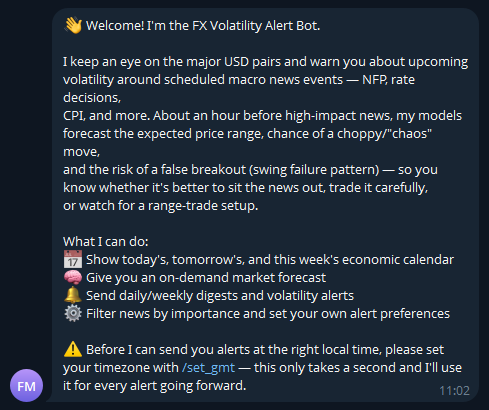
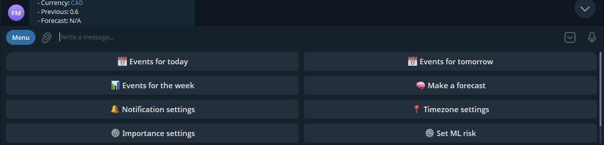
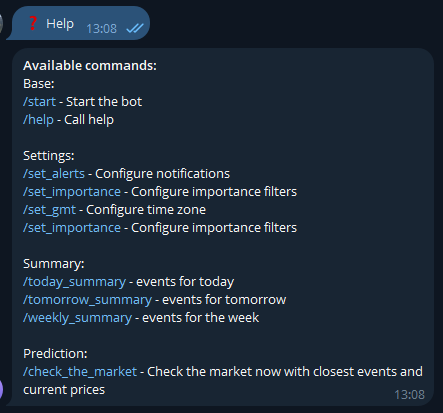
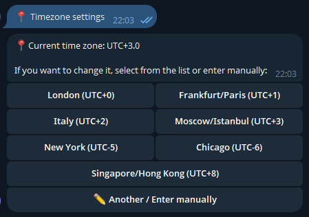
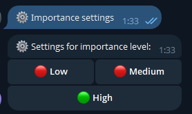
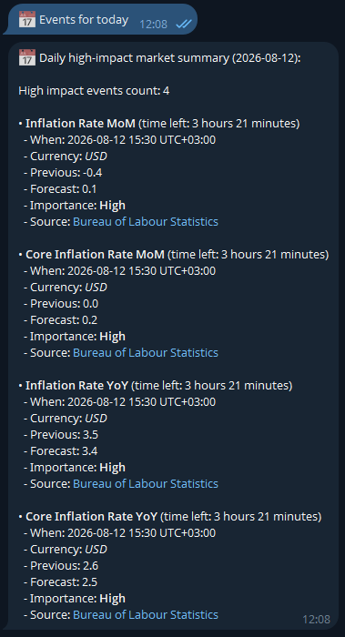
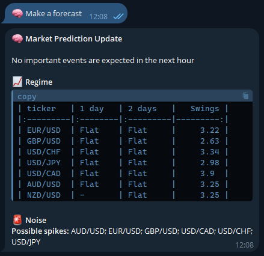
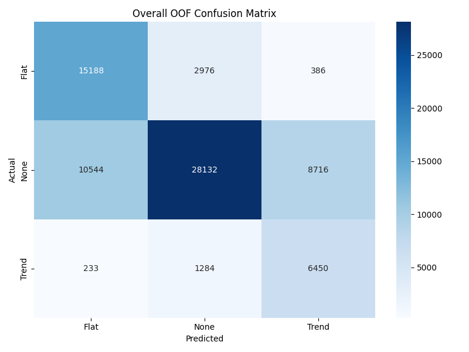
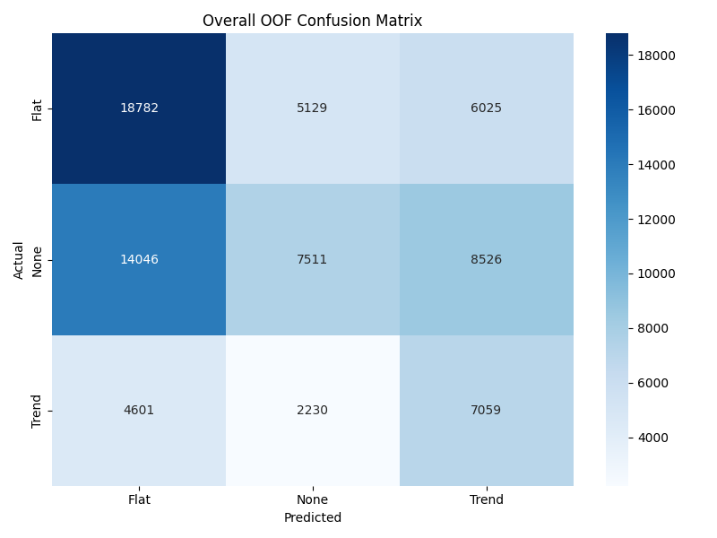

# FX Volatility Alert Bot
 
A Telegram bot that warns FX traders **~1 hour before scheduled macro news events** when the models expect elevated volatility — wide ranges, multiple direction reversals, or a swing-failure (false breakout) pattern. Built end-to-end: data collection, feature engineering, model training, and a production Telegram bot.
 
> The idea: before high-impact news (NFP, rate decisions, CPI, etc.) the market often either makes a large, choppy move in both directions or fakes a breakout and reverses. Knowing this in advance means "don't trade this hour" or "trade the range carefully, expect fakeouts."
 
## What it does
 
- Pulls the economic calendar (news events, importance, forecast/previous/actual) from **TradingView**.
- Pulls OHLC price data for major USD pairs from **Twelve Data**.
- An hour before each scheduled news event (or combination of events), a scheduled job builds live features and runs them through a set of CatBoost models to forecast:
  - **Expected range** for the next 1h / 3h / 6h / 24h (quantile regression, p10/p50/p90)
  - **Number of direction changes** (swings) expected — how "choppy" the move will be (ordinal regression)
  - **Chaos probability** — likelihood the move exceeds the pair's own ATR (binary classification, per horizon)
  - **Trend vs. flat regime** for the next 1–2 days (binary/multiclass)
  - **Swing Failure Pattern (SFP)** probability — a false breakout of a recent high/low that reverses hard, which is common around certain news events (binary classification)
- Sends a Telegram alert summarizing which pairs are at risk, the expected regime, and any detected noise (chaos / range expansion / spikes / SFP) — so the user can decide whether to sit the news out, trade it cautiously, or look for a range-trade setup.
- Also supports daily/weekly calendar digests, per-user importance filters, and timezone-aware delivery.

## Why it's interesting
 
- Full ML lifecycle, not a notebook demo: SQL-backed feature store → offline training with walk-forward (time-series) cross-validation → calibrated probabilities → saved model artifacts → live inference inside a scheduled production job.
- Multiple target types trained on the same feature set with CatBoost: quantile regression, ordinal regression, binary and multiclass classification.
- Class-imbalance handling and per-target threshold tuning (maximizing F0.5/F1/F2/F3 depending on the alerting use case — recall matters more than precision when missing a volatility spike is worse than a false alarm).
- Experiment tracking with MLflow across dozens of training runs per target/horizon.
- A real async Telegram bot (aiogram 3.x) with FSM-based onboarding, a job scheduler that re-plans itself daily around the next day's news calendar, and a normalized SQLAlchemy schema (events, prices, features, user settings).

## Architecture
 
```
News (TradingView)   ─┐
                      ├──▶  Feature pipeline  ──▶  CatBoost models  ──▶  chaos_score / SFP / range / regime
Prices (Twelve Data) ─┘              │
                                     ▼
                          SQLAlchemy DB (events, prices, features)
                                     │
                                     ▼
                     APScheduler jobs (weekly recalculation of
                     "1h before next event" triggers per pair)
                                     │
                                     ▼
                       aiogram Telegram bot ──▶  user alerts
```
 
## Tech stack
 
| Layer | Tools |
|---|---|
| Data sources | TradingView (economic calendar), Twelve Data (OHLC prices) |
| Storage | SQLAlchemy ORM + SQL database (events, prices, engineered features, user settings) |
| Feature engineering | pandas, custom `sklearn`-style transformers (event aggregation, price/target featurizers, lagged rolling stats) |
| Modeling | CatBoost (binary, multiclass, ordinal, multi-quantile regression), scikit-learn, walk-forward CV |
| Experiment tracking | MLflow |
| Bot | aiogram 3.x (async, FSM), APScheduler (cron + one-off jobs) |
| Language | Python (async/await throughout) |
 
## Modeling approach
 
Data is aggregated to an hourly grid per currency pair, joined with a rolling window of nearby news events (importance, category, source, time-to-event), and enriched with lagged rolling statistics of past outcomes for the same event type. 
For each binary target, an operating threshold is selected on OOF predictions by maximizing F0.5/F1/F2/F3 depending on the use case, rather than using a fixed 0.5 cutoff.
 

Dataset: 
- 7 major USD pairs (EURUSD, GBPUSD, USDCHF, USDJPY, USDCAD, AUDUSD, NZDUSD)
- 2010-05-07–2026-05-31 of hourly OHLC history
- 2013-01-04-2026-05-31 of events data (Count of events: 100984)
- 6 expanding-window walk-forward folds (validated on quarters)
 
Roughly a dozen targets are trained per experiment, all on the same feature matrix, each solving a different piece of "what will the market do in the next N hours":
 
- `trg_future_range_{1,3,6,24}h` — quantile regression (p10/p50/p90) on the expected high-low range → shown in the bot/README as **Future Range**
- `trg_is_chaos_{1,3,6,24}h` — binary classification: will the range exceed the pair's own ATR → shown as **Chaos**
- `trg_dir_changes` — ordinal regression: how many times price reverses direction (swing count) → shown as **Direction Changes**
- `trg_regime_{1,2}day` — multiclass: trend vs. flat vs. no-clear-regime (see [Regime Classifier](#3-regime-classifier-trend--flat--none) below for what "None" means) → shown as **Regime**
- `trg_is_sfp` — binary classification: swing failure pattern (false breakout that reverses) → shown as **Swing Failure Pattern**
- `trg_is_big_doji` — binary classification: large-bodied bar with a large wick → shown as **Big Spike**
- `trg_is_extremum_breakout` — binary classification: breakout of the 21-period channel from both sides → shown as **Double Extremum Breakout**
Validation uses **expanding-window, time-based splits** (no shuffling — this is time series) with quarter-based folds, and results are logged to MLflow per fold. All performance numbers reported below are out-of-fold walk-forward metrics — see [Model Metrics](#model-metrics) for the full breakdown, and [Limitations](#limitations--next-steps) for what's not yet validated on a held-out period.
 
## Repository structure
 
```
.
├── main.py                      # Main entrypoint (create database, run bot)
├── config.py                    # Configuration / secrets loading
├── training_functions.py        # Walk-forward CV training helpers (quantile / classification / ordinal)
├── bot/
│   ├── app.py                   # Bot entrypoint: handlers, scheduler jobs, alert composition
│   ├── scheduler.py             # Computes "next event − 1h" trigger times, weekly recalculation job
│   └── feature_engineer.py      # Time helpers for scheduling
├── ml/
│   ├── predictor.py             # Loads trained models, runs live inference (FxRangePredictor)
│   ├── news_featuring.py        # News event feature pipeline (aggregation, rounding, one-hot)
│   ├── price_featuring.py       # Price/technical feature pipeline
│   └── preprocessing.py         # sklearn-style transformers used in the notebook and in production
├── db/
│   ├── models.py                 # SQLAlchemy models: Events, Prices, UserSettings, ...
│   ├── database.py               # Engine/session setup
│   └── data_handler.py           # DB read/write and calendar refresh logic
├── models/                       # (In .gitignore)
│   ├── ml/                       # Saved (joblib) CatBoost models
│   └── feature_transformers/     # Saved (joblib) fitted transformers used at inference time
└── notebooks/
    └── train_and_retrain_model.ipynb   # End-to-end training notebook: data → features → CatBoost models
```
 
## How it runs
 
1. On startup, tables are created (SQLAlchemy) if they don't exist yet: events, prices, engineered features, user settings.
2. A **weekly job** (Sunday 18:00 UTC) refreshes the upcoming news calendar and price history.
3. A **daily job** (23:59 UTC) rebuilds the next day's schedule: for every pair/event combination, it schedules a one-off job at *event time − 1 hour* that will build live features and run the models.
4. When that job fires, the bot builds the current feature snapshot, runs it through the CatBoost models, computes range forecasts / chaos flags / SFP probability / regime, and pushes a formatted alert to subscribed users — filtered by their importance and timezone preferences.
5. Users can also request daily/weekly calendar digests and a manual "check the market now" forecast at any time.
## Telegram commands
 
```
/start                — onboarding
/set_alerts           — toggle daily / weekly / volatility alerts
/set_importance       — filter news by importance (low/medium/high)
/set_gmt              — set timezone for alert delivery
/set_risk             — choose the alerting risk profile (favor precision vs. recall — see Model Metrics)
/today_summary        — today's news events
/tomorrow_summary     — tomorrow's news events
/weekly_summary       — this week's news events
/check_the_market     — run a live forecast on demand
```
 
### Start:
Command: /start
 

 
### Main keyboard (available after "start" command)

 
### Help (/help)

 
### Set GMT (/set_gmt)
You can set your local GMT to show events corresponding to your local time.

 
### Set event importance to show (/set_importance)
You can set the importance of events, if you want to see other, less important events.
 

 
### Events summary (example for "today_summary" here)
Shows the events summary for today (tomorrow / on the week).
 

 
### Forecast (/check_the_market)
The "Make a forecast" button runs all trained models and returns a forecast for every supported pair:
expected future range, regime (trend/flat + predicted swing count), and any detected noise 
pattern (SFP, double extremum breakout, big spike, chaos). 
See [Model Metrics](#model-metrics) below for what each of these means and how reliable each one is.
 

 
--- 
 
## Model Metrics
 
The bot relies on five models, each covering a different part of the forecast. Below: what each model predicts, key metrics, and honest limitations. All metrics are out-of-fold results from walk-forward cross-validation (not in-sample training metrics).
 
### 1. Range Forecast (multi-quantile regression)
 
Predicts the future price range (quantiles 0.1 / 0.5 / 0.9) across horizons from 1h to 24h.
 
| Horizon | Pinball q0.5 | Interval width | Coverage q0.1 / q0.5 / q0.9 |
|:---|:---|:---|:---|
| 1h  | 0.187 | 1.09 | 10.6% / 49.5% / 89.0% |
| 3h  | 0.273 | 1.62 | 12.7% / 52.0% / 88.0% |
| 6h  | 0.315 | 1.91 | 15.4% / 54.4% / 90.9% |
| 24h | 0.360 | 2.14 | 14.3% / 53.8% / 90.5% |
 
Interval width grows with the horizon, which is expected — the model correctly widens its uncertainty over longer windows. The median and upper quantile (q0.9) are calibrated close to their targets.
 
**Limitation:** the lower quantile (q0.1) is under-calibrated at longer horizons (actual coverage 14–15% vs. the target 10%), meaning the lower bound gets breached more often than it should — worth accounting for if alerts are built off the lower bound.
 
### 2. Direction Changes (ordinal regression on number of reversals)
 
| Metric | Value |
|:---|:---|
| QWK | 0.41 |
| Within-1 Accuracy | 74.4% |
| MAE (rounded) | 1.05 |
 
This is an ordinal target, so exact-match accuracy isn't the metric that matters most. A QWK of 0.41 reflects moderate agreement with ground truth, while a Within-1 Accuracy of 74% shows the prediction is almost always within one class of the actual value — practically useful for ranking "calm / moderate / volatile" conditions.
 
### 3. Regime Classifier (Trend / Flat / None)
 
"Trend" and "Flat" mean the model expects a directional move or a range-bound period, respectively, over the horizon. **"None" means neither condition was clearly met in the training labels** — a genuinely mixed or ambiguous period, not a missing value. It's the hardest class to call and the main source of error below.
 
#### 1 Day:

 
#### 2 Days:

 
| Horizon | Trend F1 | Flat F1 | None F1 |
|:---|:---|:---|:---|
| 1 day  | 0.55 | 0.68 | 0.71 |
| 2 days | 0.40 | 0.56 | 0.33 |
 
At the 1-day horizon the model performs reliably: recall for Trend/Flat is high (0.81–0.82) — it favors not missing a potential regime shift over precision. At 2 days, quality drops noticeably, especially for the None class (recall 0.25). **This horizon should be flagged as experimental** and not relied on as a primary signal until it's retrained.
 
### 4. Binary "noise" targets (Swing Failure Pattern, Double Extremum Breakout, Big Spike, Chaos)
 
All four are rare events (base rate 3.7–15.3%), so ROC-AUC alone isn't very informative — the more telling number is PR-AUC lift over the base rate.
 
| Target | Base rate | ROC-AUC | PR-AUC | Lift over base rate | best-F1 Precision / Recall |
|:---|:---|:---|:---|:---|:---|
| Double Extremum Breakout | 3.7% | 0.90 | 0.26 | ~7x | 0.28 / 0.46 |
| Swing Failure Pattern | 5.4% | 0.88 | 0.38 | ~7x | 0.37 / 0.46 |
| Chaos (24h) | 13.0% | 0.85 | 0.48 | ~3.7x | 0.43 / 0.58 |
| Big Spike | 15.3% | 0.74 | 0.33 | ~2.1x | 0.27 / 0.70 |
 
Double Extremum and SFP show the strongest discrimination relative to random guessing (~7x lift), and Chaos offers the best-balanced precision/recall of the four. **Big Spike is the weakest model in the group** (ROC-AUC 0.74, only a 2.1x lift), and either needs further work or should carry less weight in the combined chaos_score / alerting logic.
 
The operating threshold per model is chosen for the use case: `best_f0.5` when false alerts are costlier, `best_f2`/`best_f3` when missing an event is costlier — configurable per user via `/set_risk`.
 
---
## Setup
 
> This is a personal/portfolio project — some config (API keys, DB connection) is environment-specific and not included here.
 
```bash
git clone <repo-url>
cd <repo>
pip install -r requirements.txt
 
# set environment variables (Telegram bot token, Twelve Data API key, DB URL, etc.)
cp .env.example .env
 
python app.py
```
 
Model training/retraining is done separately in `train_and_retrain_model.ipynb`, which walks through: loading events and prices from the database, building the feature pipeline, and training/evaluating each CatBoost target with walk-forward cross-validation and MLflow tracking.
 
## Limitations & next steps
 
- Metrics above are out-of-fold walk-forward results, not a live, chronologically-later holdout — a forward-testing / paper-trading track record would make the case stronger.
- The 2-day regime classifier is meaningfully weaker than the 1-day version and shouldn't be treated as a primary signal yet.
- The Big Spike classifier is the weakest of the four binary "noise" targets and is a priority for feature work.
- The lower quantile (q0.1) of the range forecast is under-calibrated at longer horizons.
- No backtested P&L / strategy layer yet — the bot currently informs "expect volatility," not "take this trade."
- Feature/model set is being iterated on (see the `V2` section of the notebook); next steps include tightening calibration for the SFP model and adding a lightweight backtest harness.
## Disclaimer
 
This project is for educational and research purposes. It is not financial advice, and volatility forecasts are probabilistic, not guarantees.